# Progress 3 - Implementasi Database dan Pengujian

## 1. Script SQL DDL (CREATE DATABASE, CREATE TABLE)

### Membuat Database

```sql
CREATE DATABASE inventori_laboratorium;
USE inventori_laboratorium;
```

### Tabel Kategori Barang

```sql
CREATE TABLE kategori_barang (
    id_kategori INT PRIMARY KEY,
    nama_kategori VARCHAR(50) NOT NULL UNIQUE
);
```

### Tabel Kondisi Barang

```sql
CREATE TABLE kondisi_barang (
    id_kondisi INT PRIMARY KEY,
    nama_kondisi VARCHAR(30) NOT NULL UNIQUE
);
```

### Tabel Laboratorium

```sql
CREATE TABLE laboratorium (
    id_lab INT PRIMARY KEY,
    nama_lab VARCHAR(100) NOT NULL,
    lokasi VARCHAR(100) NOT NULL
);
```

### Tabel Mahasiswa

```sql
CREATE TABLE mahasiswa (
    nim VARCHAR(15) PRIMARY KEY,
    nama_mahasiswa VARCHAR(100) NOT NULL,
    prodi VARCHAR(50) NOT NULL,
    semester INT NOT NULL
);
```

### Tabel Laboran

```sql
CREATE TABLE laboran (
    id_laboran INT PRIMARY KEY,
    nama_laboran VARCHAR(100) NOT NULL,
    no_hp VARCHAR(15) NOT NULL
);
```

### Tabel Barang

```sql
CREATE TABLE barang (
    id_barang INT PRIMARY KEY,
    nama_barang VARCHAR(100) NOT NULL,
    jumlah_stok INT NOT NULL,
    id_kategori INT NOT NULL,
    id_kondisi INT NOT NULL,
    id_lab INT NOT NULL,

    FOREIGN KEY (id_kategori)
        REFERENCES kategori_barang(id_kategori),

    FOREIGN KEY (id_kondisi)
        REFERENCES kondisi_barang(id_kondisi),

    FOREIGN KEY (id_lab)
        REFERENCES laboratorium(id_lab)
);
```

### Tabel Pengguna

```sql
CREATE TABLE pengguna (
    id_pengguna INT PRIMARY KEY,
    username VARCHAR(50) NOT NULL UNIQUE,
    password VARCHAR(255) NOT NULL,
    role VARCHAR(20) NOT NULL,
    id_laboran INT UNIQUE,

    FOREIGN KEY (id_laboran)
        REFERENCES laboran(id_laboran)
);
```

### Tabel Peminjaman

```sql
CREATE TABLE peminjaman (
    id_pinjam INT PRIMARY KEY,
    tanggal_pinjam DATE NOT NULL,
    status_pinjam VARCHAR(20) NOT NULL,
    nim VARCHAR(15) NOT NULL,
    id_laboran INT NOT NULL,

    FOREIGN KEY (nim)
        REFERENCES mahasiswa(nim),

    FOREIGN KEY (id_laboran)
        REFERENCES laboran(id_laboran)
);
```

### Tabel Detail Peminjaman

```sql
CREATE TABLE detail_peminjaman (
    id_detail INT PRIMARY KEY,
    id_pinjam INT NOT NULL,
    id_barang INT NOT NULL,
    jumlah INT NOT NULL,

    FOREIGN KEY (id_pinjam)
        REFERENCES peminjaman(id_pinjam),

    FOREIGN KEY (id_barang)
        REFERENCES barang(id_barang)
);
```

### Tabel Pengembalian

```sql
CREATE TABLE pengembalian (
    id_kembali INT PRIMARY KEY,
    tanggal_kembali DATE NOT NULL,
    kondisi_kembali VARCHAR(30) NOT NULL,
    id_pinjam INT UNIQUE,

    FOREIGN KEY (id_pinjam)
        REFERENCES peminjaman(id_pinjam)
);
```

---

## 2. Constraint (PK, FK, UNIQUE, NOT NULL)

### PRIMARY KEY (PK)

Digunakan sebagai identitas unik pada setiap record dalam tabel.

Contoh:

```sql
id_barang INT PRIMARY KEY
```

### FOREIGN KEY (FK)

Digunakan untuk menghubungkan tabel yang saling berelasi.

Contoh:

```sql
FOREIGN KEY (id_kategori)
REFERENCES kategori_barang(id_kategori)
```

### UNIQUE

Digunakan untuk mencegah data yang sama tersimpan lebih dari satu kali.

Contoh:

```sql
username VARCHAR(50) UNIQUE
```

### NOT NULL

Digunakan agar data wajib diisi dan tidak boleh kosong.

Contoh:

```sql
nama_barang VARCHAR(100) NOT NULL
```

---

## 3. Data Uji (INSERT)

### Data Kategori Barang

```sql
INSERT INTO kategori_barang VALUES
(1,'Perangkat Komputer'),
(2,'Perangkat Jaringan'),
(3,'Peralatan Praktikum');
```

### Data Kondisi Barang

```sql
INSERT INTO kondisi_barang VALUES
(1,'Baik'),
(2,'Rusak Ringan'),
(3,'Rusak Berat');
```

### Data Laboratorium

```sql
INSERT INTO laboratorium VALUES
(1,'Lab Komputer UMRAH','FTTK'),
(2,'Lab Jaringan UMRAH','FTTK');
```

### Data Mahasiswa

```sql
INSERT INTO mahasiswa VALUES
('2501020140','Aldi Saputra','Informatika',2),
('2501020134','Farel','Informatika',2),
('2501020130','Prayoga Kie','Informatika',2),
('2501020133','Egi Fahrezi Winanda','Informatika',2);
```

### Data Laboran

```sql
INSERT INTO laboran VALUES
(1,'Bapak Ferdi','081234567890');
```

### Data Barang

```sql
INSERT INTO barang VALUES
(1,'PC Praktikum',25,1,1,1),
(2,'Laptop Lenovo',10,1,1,1),
(3,'Router Cisco',8,2,1,2),
(4,'Switch Mikrotik',12,2,1,2),
(5,'Multimeter Digital',15,3,1,1);
```

### Data Pengguna

```sql
INSERT INTO pengguna VALUES
(1,'admin_lab','admin123','Admin',1);
```

### Data Peminjaman

```sql
INSERT INTO peminjaman VALUES
(1,'2026-06-20','Dipinjam','2501020140',1),
(2,'2026-06-21','Dipinjam','2501020134',1);
```

### Data Detail Peminjaman

```sql
INSERT INTO detail_peminjaman VALUES
(1,1,3,1),
(2,1,4,1),
(3,2,5,2);
```

### Data Pengembalian

```sql
INSERT INTO pengembalian VALUES
(1,'2026-06-22','Baik',1);
```

---

## 4. Minimal 10 Query SQL

### Query 1

```sql
SELECT * FROM barang;
```

### Query 2

```sql
SELECT * FROM mahasiswa;
```

### Query 3

```sql
SELECT nama_barang, jumlah_stok
FROM barang;
```

### Query 4

```sql
SELECT *
FROM barang
WHERE jumlah_stok < 10;
```

### Query 5

```sql
SELECT b.nama_barang,
       k.nama_kategori
FROM barang b
JOIN kategori_barang k
ON b.id_kategori = k.id_kategori;
```

### Query 6

```sql
SELECT p.id_pinjam,
       m.nama_mahasiswa
FROM peminjaman p
JOIN mahasiswa m
ON p.nim = m.nim;
```

### Query 7

```sql
SELECT b.nama_barang,
       d.jumlah
FROM detail_peminjaman d
JOIN barang b
ON d.id_barang = b.id_barang;
```

### Query 8

```sql
SELECT status_pinjam,
COUNT(*) AS total
FROM peminjaman
GROUP BY status_pinjam;
```

### Query 9

```sql
UPDATE barang
SET jumlah_stok = 20
WHERE id_barang = 1;
```

### Query 10

```sql
DELETE FROM pengembalian
WHERE id_kembali = 1;
```

---

## 5. Skenario Pengujian

| No | Skenario Pengujian | Hasil Yang Diharapkan |
|----|-------------------|----------------------|
| 1 | Menambah data barang | Data berhasil disimpan |
| 2 | Menambah data mahasiswa | Data berhasil disimpan |
| 3 | Menambah data peminjaman | Data berhasil disimpan |
| 4 | Menampilkan data barang | Data tampil dengan benar |
| 5 | Menampilkan relasi barang dan kategori | Data sesuai relasi |
| 6 | Menampilkan data peminjam | Data sesuai relasi |
| 7 | Menampilkan detail peminjaman | Data sesuai transaksi |
| 8 | Menghitung jumlah peminjaman | Data berhasil dihitung |
| 9 | Mengubah stok barang | Data berhasil diperbarui |
| 10 | Menghapus data pengembalian | Data berhasil dihapus |

---

## 6. Screenshot Hasil Implementasi dan Query

### SHOW TABLES
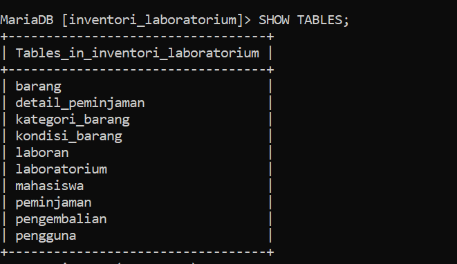

### DESC Barang

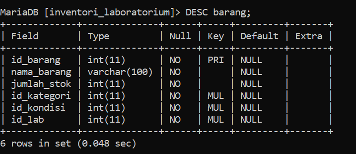

### DESC Peminjaman
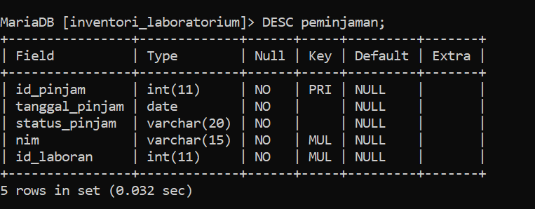

### Query 1

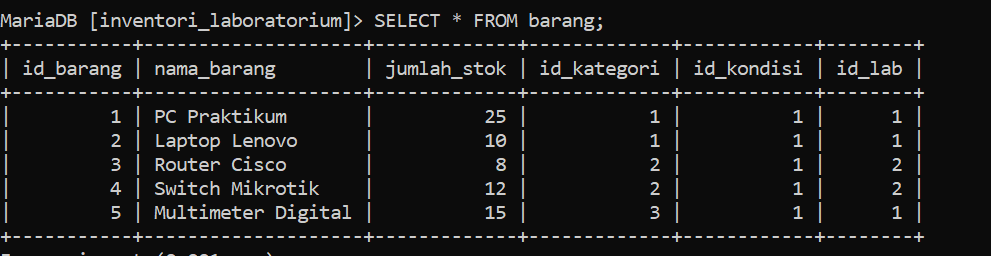

### Query 2

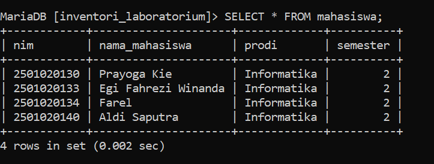

### Query 3

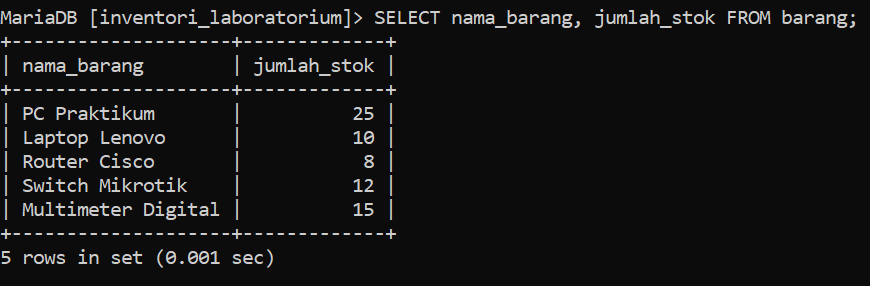

### Query 4

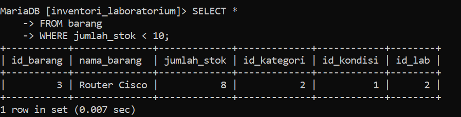
### Query 5

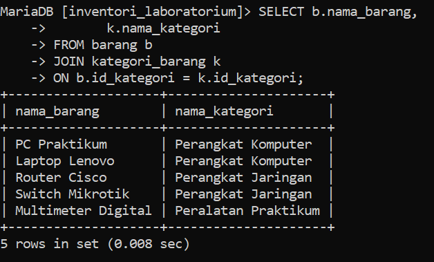

### Query 6

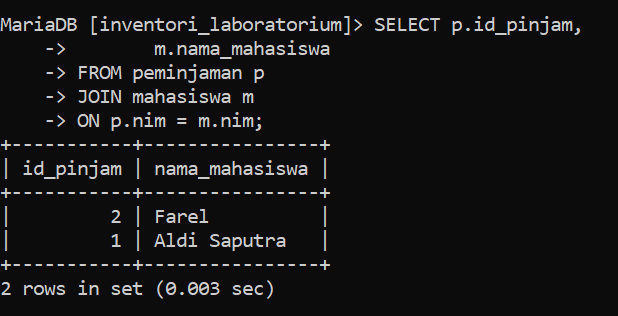

### Query 7

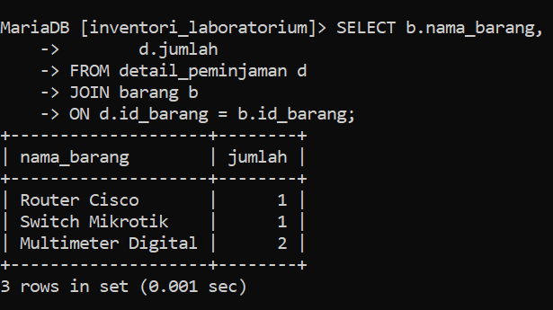

### Query 8

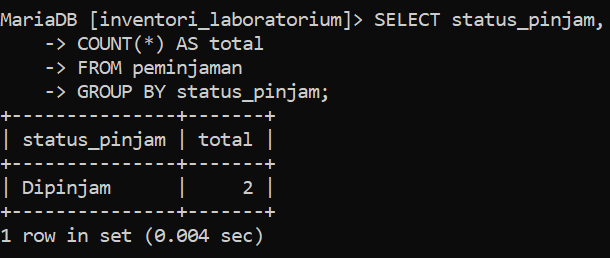

### Query 9

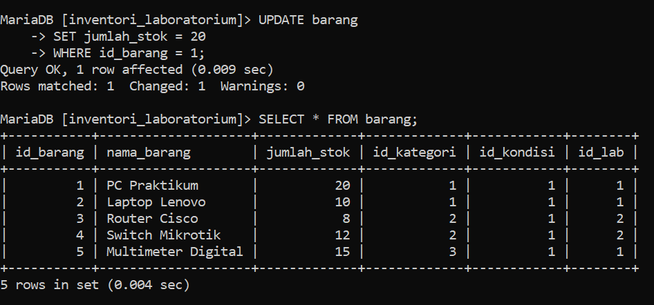

### Query 10

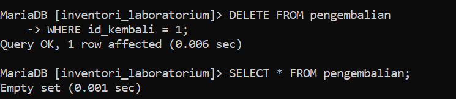


